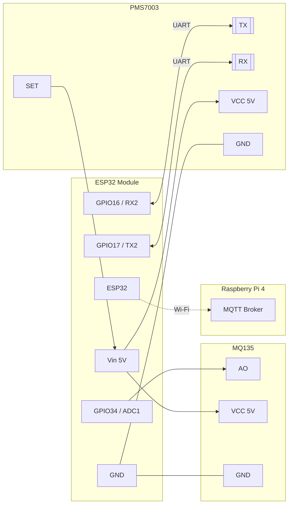

# Sơ đồ nguyên lý phần cứng

## Cách mở file Markdown và sơ đồ

- Mở file `.md` bằng **Visual Studio Code**, **Obsidian**, hoặc bất kỳ trình soạn thảo Markdown nào (thậm chí Notepad/VSCode đều đọc được). Nếu muốn xem với định dạng đẹp, hãy chọn chế độ “Preview”.
- Bạn cũng có thể truy cập trực tiếp trên GitHub: vào thư mục `docs/`, bấm vào file `hardware_schematic.md` và chọn tab **Preview**.
- Sơ đồ được biểu diễn bằng **Mermaid** ngay trong tài liệu, thuận tiện khi làm việc ngoại tuyến hoặc đưa vào báo cáo.
- Nếu cần ảnh để chèn vào slide hoặc in ấn, sử dụng tệp [`hardware_schematic.svg`](hardware_schematic.svg). Đây là định dạng văn bản (không phải nhị phân) nên xem tốt trên GitHub và có thể mở bằng trình duyệt bất kỳ.

Sơ đồ tổng quan mô tả cách kết nối ESP32 với cảm biến PMS7003, MQ135 và khả năng giao tiếp không dây với Raspberry Pi 4. Nếu cần chỉnh sửa, bạn có thể sao chép đoạn Mermaid trên vào công cụ như [Mermaid Live Editor](https://mermaid.live/) để xuất ảnh SVG/PNG theo nhu cầu.

## Bảng nối dây chi tiết

| Thành phần | Chân | Kết nối | Ghi chú |
| --- | --- | --- | --- |
| ESP32 | Vin (5V) | 5V USB / Adapter | Cấp nguồn chung cho cảm biến |
| ESP32 | GND | GND chung | Tránh vòng lặp đất |
| ESP32 | GPIO16 (RX2) | PMS7003 TX | UART2 nhận dữ liệu bụi |
| ESP32 | GPIO17 (TX2) | PMS7003 RX | Dùng để gửi lệnh sleep/wake |
| ESP32 | GPIO34 (ADC1_CH6) | MQ135 AO | Đọc giá trị analog đã phân áp |
| PMS7003 | SET | Vin (qua 10kΩ) | Giữ mức cao để hoạt động |
| PMS7003 | RESET | Không nối / kéo lên 5V | Chỉ dùng khi cần reset phần cứng |
| MQ135 | DO | Không sử dụng | Tùy chọn làm ngưỡng cảnh báo |
| MQ135 | Heater | Vin 5V | Đảm bảo nguồn đủ 200mA |
| ESP32 | 3V3 | Không cấp cho cảm biến | Không đủ dòng cho PMS7003 |
| ESP32 | EN | Không nối | |

## Ghi chú nguồn và bảo vệ

- Tổng dòng PMS7003 ~100mA, MQ135 ~150mA (khi heater nóng), ESP32 ~240mA đỉnh → nên dùng adapter 5V 1A.
- Nếu dây dài >30cm, bổ sung tụ điện 100µF gần PMS7003 để ổn định.
- Khuyến nghị đặt thêm bộ chuyển mức logic nếu dùng PMS7003 bản 3.3V; đa số module hỗ trợ trực tiếp 5V.

## Kết nối với Raspberry Pi 4

- Raspberry Pi 4 không kết nối dây trực tiếp, chỉ cần cùng mạng Wi-Fi với ESP32.
- Broker MQTT có thể chạy trên chính Raspberry Pi (Mosquitto). ESP32 publish dữ liệu vào topic `air_quality/measurements`.
- Collector Python trong `raspberry_pi/collector/collector.py` subscribe MQTT và ghi dữ liệu xuống InfluxDB.

